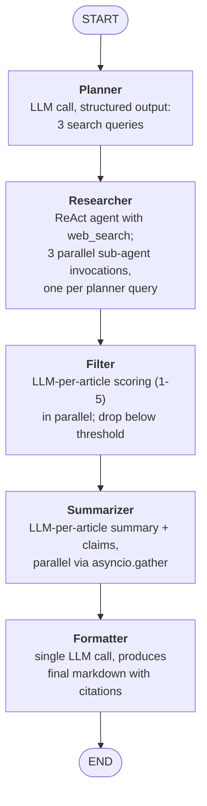
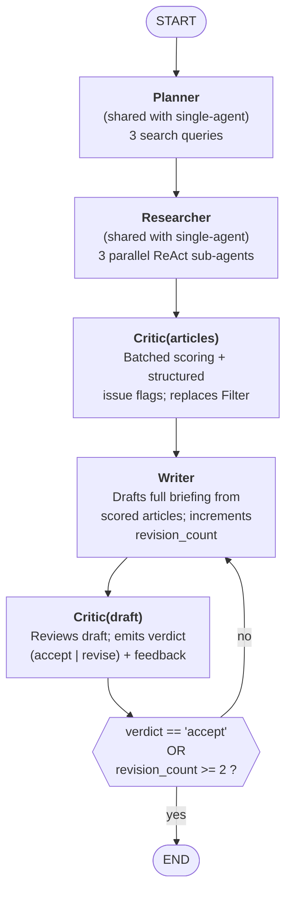

# News Briefing Agent — System Design

## Overview

This project is a research agent that produces short, citation-grounded news briefings on a user-supplied topic. It exists in two parallel implementations in the same codebase: a single-agent pipeline (the baseline, built first) and a multi-agent pipeline (the variant built to make the architectural tradeoff concrete). Both take the same input — a free-text topic string, validated to 15-500 characters — and return the same output shape: a `BriefingResult` union of `BriefingSuccess` (markdown body + source URLs + thread_id for LangSmith lookup) or `BriefingFailure` (reason enum + message + thread_id). The public API, `run_briefing()` and `run_briefing_multi_agent()`, is symmetric by design so downstream code — and the comparison harness — can swap pipelines without touching anything else.

The motivation was twofold. First, I wanted to ship a working Quadrant 2 system — a deterministic workflow with one embedded agent — end-to-end, including the observability and guardrails production systems need. The single-agent pipeline covers that. Second, I wanted the multi-agent version to exist side-by-side so the "when does multi-agent earn its complexity" question could be answered empirically rather than from intuition. On the three topics I ran through both pipelines, the answer turned out to be more nuanced than I expected — which is what Section 5 covers.

Neither pipeline is production-ready. Both are built around the same Researcher (the one real ReAct agent, with web_search as its single tool), the same Planner (topic decomposition into three search queries), and the same error-handling contract (fail-loud inside the graph, never raise out of the runner). The comparison between them is about what happens after article retrieval — whether scoring + summarization + formatting happens as a linear workflow, or as a supervisor-coordinated set of agents with a Critic that can trigger revisions.

## Architecture 1: Single-Agent Pipeline (Quadrant 2)

Five nodes, six plain edges, no conditional edges at the outer layer. The only place where the model decides what happens next is inside the Researcher's `create_agent` subgraph — the outer pipeline is a deterministic workflow. This is the shape Anthropic's "Building effective agents" calls a **workflow with an embedded agent**, and what I've been calling Quadrant 2: reach for full agency only where the task genuinely requires it; keep everything else as predictable code paths.

**State container.** A `TypedDict` (`BriefingState`) with six fields that accumulate across the pipeline: `topic`, `run_started_at`, `search_queries`, `raw_articles`, `scored_articles`, `summaries`, and `final_briefing`. The four list-typed fields use the `add` reducer so node outputs append rather than overwrite. The rest overwrite on update. Full schemas are in SPEC.md.

**Where the model drives control flow.** Only inside the Researcher. The `create_agent` subgraph runs a standard ReAct loop — model node → tools node → conditional edge back to model if a tool call is pending, else END. The outer pipeline never consults the model about routing. Every node runs; no node is skipped based on model output.

**Where parallelism lives.** Three places, all `asyncio.gather`-based: inside the Researcher (fan-out over planner queries to run sub-agents concurrently), inside the Filter (fan-out per article for scoring), and inside the Summarizer (fan-out per article for summary + key-claim generation). The async is wired end-to-end from `runner.ainvoke` through every node; LangSmith traces show the per-child spans overlapping on the timeline rather than stacking.

**Failure modes.** Input validation (topic length) runs in the runner before graph entry. Inside the graph, each node fails loud on schema violations; the runner catches the three specific exception types it knows about (GraphRecursionError, ValidationError, and a generic fallback) and returns a typed `BriefingFailure` rather than propagating. Per-item failures inside Filter and Summarizer (one bad article out of ten) are logged and skipped via `return_exceptions=True` on `asyncio.gather` — the briefing can still be assembled from whatever survives. FAILURES.md has the debugging log from the Day 4 build.

## Architecture 2: Multi-Agent Pipeline (Supervisor Pattern)

Four agents, one conditional edge, one revision loop. The four agents are Researcher, Critic(articles), Writer, and Critic(draft); the conditional edge sits on Critic(draft)'s output and is the only place in the outer graph where the model drives routing. The Planner is shared with the single-agent pipeline and runs unchanged.

**The one model-driven branch.** Critic(draft) emits a structured verdict (`Literal["accept", "revise"]`). The conditional edge — which I've been calling the "supervisor" — is a pure Python function that reads two fields from state (`critic_verdict` and `revision_count`) and routes to either the Writer or END. There is no LLM call inside the supervisor. This is deliberate: routing logic as simple as `if verdict == "revise" and count < 2` doesn't earn a model call, and using one would be performance theater.

**State container.** `MultiAgentBriefingState` extends `BriefingState` with four overwrite-on-update fields: `revision_count` (counter; see design decisions), `critic_verdict`, `critic_feedback` (pre-formatted bullet string), and `draft` (the Writer's current in-progress markdown before Critic(draft) approves it as `final_briefing`). Revision history is intentionally *not* accumulated — what the Writer remembers between rounds is implicit in the Critic's feedback, which lives in state for exactly one round before being overwritten.

**Revision loop mechanics.** The Writer always increments `revision_count` when it produces a draft (so first draft has count=1, after one revision count=2). Critic(draft) always writes `final_briefing = draft` regardless of verdict, so the force-accept path at count=2 terminates with a valid briefing without the conditional edge having to touch state. If the Critic returns a malformed verdict (shouldn't happen with `response_format` on, but defensive), the node falls back to "accept" and logs — the revision cap is a safety bound, not a hiding place for bugs.

**What happened to Summarizer and Formatter.** Both are absent from the multi-agent pipeline. The Writer subsumes their combined job: given scored articles (with flags from Critic(articles)), produce a full markdown briefing in one LLM call with citation discipline enforced by the prompt and verified by Critic(draft). The `summaries` field inherited from `BriefingState` goes unused in this pipeline — a known no-op that the Day 6 backlog covers.

**Where parallelism lives, and where it doesn't.** Researcher parallelism is inherited from the single-agent pipeline (three concurrent sub-agents). Critic(articles) is a *batched* call over the whole article set rather than a per-article fan-out, because "duplicate" detection needs visibility into the whole batch — the tradeoff is one longer LLM call instead of N short parallel ones. Writer and Critic(draft) are single LLM calls by nature. The revision loop itself is serial by design: the Writer must see the Critic's feedback before starting its next draft.

**Failure modes.** Same as single-agent at the runner boundary — one validated contract for both pipelines. Inside the graph, the additional failure modes are: Critic(articles) agent returning no structured_response (raises; the runner catches), Writer producing a draft on empty sources (emits a placeholder "no sufficiently relevant sources" briefing rather than failing), Critic(draft) returning malformed verdict (falls back to accept, as noted above), and the Critic rejecting every draft (force-accepts at count=2, producing a visible "second-draft" briefing even if the Critic wasn't satisfied).

## Design Decisions

Eight decisions shaped the architecture. None of them was obvious going in; most were made (or corrected) during the build rather than at the spec stage. I'm listing them with the alternative I rejected, because the comparison is what makes the choice legible.

### 1. The supervisor is a conditional edge, not an LLM node

The canonical "supervisor pattern" tutorial has a supervisor agent at the center: an LLM that reads state and decides which specialist to invoke next. I implemented the supervisor as a plain Python conditional edge instead — a function that reads `critic_verdict` and `revision_count` from state and routes to either Writer or END.

The LLM-supervisor version was rejected because the routing logic in my graph is `if verdict == "revise" and count < 2` — deterministic and trivial. Using an LLM for this would add a call's worth of latency and tokens for a decision a Python `if` statement makes correctly. The substantive model-driven decision in the multi-agent pipeline is the Critic(draft)'s verdict itself, not the routing that acts on it.

The decision: **supervisor pattern doesn't require an LLM supervisor**. The pattern is about coordinated specialists with a central routing authority, not about using a model for the routing.

### 2. Explicit `StateGraph` at the outer layer, `create_agent` for embedded agents

LangChain gives you two construction options for agentic systems. At the graph layer, `langgraph.graph.StateGraph` — you define nodes and edges by hand, typed state via TypedDict, full control. At the agent layer, `langchain.agents.create_agent` — one function call returns a compiled ReAct runnable with model, tools, optional `response_format`, and middleware hooks.

I use both, and the dividing line is structural vs. behavioral. When I need a *shape* (custom state fields, non-ReAct topology, fan-out, a revision loop), I drop to explicit `StateGraph`. When I need a ReAct loop with some customization (structured output, a specific system prompt), I use `create_agent` and let it compile into a subgraph.

The Researcher is the cleanest example: it's a ReAct agent (model + tools + conditional-loop-to-END), so `create_agent` is exactly right. The outer pipeline has custom state and non-ReAct structure (linear in single-agent, loop-back in multi-agent), so `StateGraph` is exactly right. The two compose cleanly — the Researcher appears as one node in the outer graph, its own ReAct subgraph visible but opaque in the trace.

The alternative I rejected: using `create_agent` for everything via multi-agent tooling (subagents, handoffs). LangChain's 2025/2026 documentation reorganization surfaced these patterns, and for certain shapes they're appropriate. But they coordinate *through tool calls between agents*, which adds an LLM call per hop for no gain when the coordination logic is deterministic.

### 3. Wire format vs. state artifact types (the msgpack discovery)

I hit this as a bug on Day 5 and it's the kind of detail that's not in the LangGraph tutorials, so it's worth codifying as a pattern.

LangGraph's default checkpointer (`MemorySaver`) serializes state via msgpack, which can't handle `HttpUrl` or other non-primitive Pydantic types. This matters for agents built with `create_agent(response_format=X)`: the agent's sub-state includes the structured response as a live Pydantic object, and that sub-state gets checkpointed when the outer graph's checkpointer runs. If `X` contains any non-primitive fields, the whole run dies with `TypeError: Type is not msgpack serializable`.

The fix is a separation the Researcher already had and that I had to back-port to Critic(articles) after the first smoke test failed: define a private primitive-only "wire format" Pydantic model (only `str`, `int`, `Literal`, etc. — no `HttpUrl`, no nested custom types) as the agent's `response_format`. Read it in the node wrapper, hydrate to the rich state artifact types (with `HttpUrl`, etc.) on the way out.

This is now a project-wide invariant: every `response_format` uses primitive types only; rich types live in `schemas.py` for state and nowhere else. Documented as a pattern so the next agent I add doesn't rediscover it.

### 4. `revision_count` is a counter ("drafts produced so far"), not a revision number

The revision loop cap reads `if revision_count >= 2` to force-accept. Given that, `revision_count` could mean either:

- **Semantic reading:** number of *revisions* done. First draft has count=0; after one revision, count=1.
- **Counter reading:** number of drafts *produced*. First draft has count=1; after one revision, count=2.

I picked counter reading. The conditional-edge test `revision_count >= 2` then reads as "we've produced 2 drafts, that's enough" — which matches the force-accept semantics cleanly. Under semantic reading, the cap would be `revision_count >= 1` and the off-by-one between "1 revision" and "2 drafts total" would live in the conditional edge instead of in the counter.

The cost is a slight counter-intuition at the field name: `revision_count` is off by one from "number of revisions." The Writer docstring spells this out. If this ever bites an engineer, rename to `draft_count` as a one-line refactor.

### 5. Critic(articles) replaces Filter rather than coexisting with it

In the multi-agent pipeline, I could have kept the Filter node and added Critic(articles) as a richer second scoring pass. I chose to replace instead of augment.

Filter and Critic(articles) serve the same role — score articles and drop or flag low-quality ones — so running both would duplicate work without a principled tiebreaker between them. Replacement keeps the two architectures genuinely different (not "single-agent plus a revision loop" but "single-agent vs. a different scoring philosophy plus a revision loop"), and makes the Section 5 comparison more informative: Filter's output (1-5 score + prose rationale) and Critic(articles)' output (1-5 score + structured flags from a closed enum) are different shapes of artifact, and downstream nodes can consume the flags as typed data rather than free-form prose.

The rejected alternative — Filter + Critic(articles) co-existing — would have added cost with no principled way to resolve disagreements between the two scorers. Better to pick one per pipeline and evaluate them against each other.

### 6. Writer subsumes Summarizer + Formatter in the multi-agent pipeline

In the single-agent pipeline, Summarizer produces per-article summaries and Formatter synthesizes them into a briefing — two LLM expansion stages. The multi-agent pipeline skips Summarizer entirely; the Writer takes scored articles directly and produces the final markdown in one call.

The motivation was the revision loop. Per-article summaries aren't what the Critic reviews — the Critic reviews the draft. If a revision is triggered, we'd either have to re-run Summarizer (expensive, and per-article summaries rarely change across revisions) or keep them frozen and revise only at the Formatter level. Both were awkward. Collapsing Summarizer into the Writer means revision is a single-node operation with clear inputs and outputs.

The cost is less structured intermediate data. In the single-agent pipeline, Summarizer's `key_claims` field gives a Day 6 eval harness a clean target for faithfulness checks — "for each key_claim, is it supported by the source?" Multi-agent loses that shape. On the other hand, Critic(draft)'s verdict + feedback is a different kind of structured eval signal the single-agent pipeline doesn't have. Different pipelines surface different eval angles — which is itself an observation worth carrying into Day 6.

### 7. Revision cap at 2 drafts

The force-accept threshold (`revision_count >= 2`) gives the Writer one first-draft chance plus one revision chance. A third draft is never produced; after the second Critic(draft) review, the loop exits regardless of verdict.

Two drafts is the minimum that gets a feedback loop at all. One draft is no loop (Critic(draft) can accept or reject but rejection has no consequence); three drafts would be one extra call's worth of latency and tokens for a Critic-Writer-Critic round I've seen no evidence helps. On the three topics I ran, the Critic accepted either on draft 1 or draft 2; force-accept never fired. If Day 6 evals show the second draft is systematically better than the first, the cap is the right place to tune that — three would give the Critic one more chance to catch something the second review missed. If they show no difference, the cap could come down to 1 draft (no revision) for most topics and only trigger the loop on a quality signal.

### 8. No LangChain middleware

LangChain's `create_agent` accepts middleware hooks — `@before_model`, `@after_model`, `@wrap_tool_call`, `@wrap_model_call`, `@dynamic_prompt` — that let you customize behavior within a ReAct loop without dropping to explicit StateGraph. I don't use any of them in this project.

Middleware would be the right tool for input guardrails (PII redaction, prompt-injection detection), output guardrails (schema validation beyond `response_format`, safety classifiers), retries with backoff, or human-in-the-loop approval on tool calls. My customizations on this project were *structural* — adding conditional edges, custom state fields, revision loops — so explicit StateGraph was the right level. Middleware is the layer I'd reach for first when Day 6 adds behavioral guardrails (citation-URL validation, per-claim faithfulness checks) without restructuring the graph. Explicit tracking item in the Day 6 backlog.

## Tradeoff Findings

I ran both pipelines on three topics — EU AI Act enforcement, US tariff policy changes, central bank interest rate decisions — and compared outputs side-by-side. The results are mixed in a way that's interview-useful because it's honest: the multi-agent architecture earned its cost on one topic, was neutral-to-negative on another, and on the third exposed a confound in my own evaluation setup before I could answer the architectural question at all.

### Summary table

| Topic | Single-agent | Multi-agent | Verdict |
|---|---|---|---|
| US tariffs | 105s, 12 sources, 11,989 chars | 89s, 12 sources, 6,469 chars | **Multi-agent clearly better** |
| EU AI Act | 78s, 12 sources, 11,060 chars | 105s, 9 sources, 3,455 chars | **Single-agent better on coverage** |
| Central bank | 75s, 10 sources, 6,612 chars | 120s, 7 sources, 3,180 chars | **Comparison confounded** |

Multi-agent averaged roughly 1.3x the latency and a comparable or slightly smaller source count. The briefing-length gap is real but needs the topic-by-topic read to interpret.

### US tariffs — the architecture earning its cost

The single-agent tariffs briefing included several claims attributed to wealth-management and accounting blogs: "$1,500 more per year per household" cited to elevatewealth.ae, "86-94% of tariff costs fall on American firms and consumers" cited to the same blog for a NY Fed research finding, a GDP-impact causal claim from the same source, and a $1M-tariff-cost-per-$10M-import figure from wiss.com. None of these are obviously wrong, but none of them trace to primary research in their citations.

The multi-agent briefing dropped every blog-cited claim. In their place, it added primary-source attribution: a Budget Lab at Yale unemployment projection (0.3 percentage points by end of 2026), Tax Foundation estimates attributed by name, and ING analysis also attributed by name. Same source count, meaningfully higher average source quality.

This is the defense-in-depth story: Critic(articles) flags blog-laundered primary-source claims as `low_credibility` or `unsupported_claim`, and either the Writer avoids them in the first draft or Critic(draft) catches them on review. Trace inspection confirmed the former — the Writer never cited the flagged sources; no revision was needed.

### EU AI Act — conservatism costs coverage

On the EU AI Act topic the pattern inverted. Single-agent cited the European Digital Rights (EDRi) civil society open letter on implementation delays, a compliance-readiness piece from MIT Sloan Management Review, a breakdown of Germany's implementation approach, and coverage of the Commission's proposed digital omnibus. The multi-agent version dropped all of these.

None of the dropped sources were obviously low-quality. EDRi is a reputable civil society NGO; MIT SMR is a peer-edited publication. The multi-agent version replaced some of this coverage with a Poland-creates-centralized-authority finding from Oxford BSG, and added an explicit caveat ("though specific implementation details are not independently verified") on a Deloitte source. Net effect: narrower coverage, a caveat, and one new finding from a source the single-agent run didn't retrieve.

Verdict: the 1.3x cost delta wasn't earned on this topic. The Critic was conservative in a way that cost me coverage without clear faithfulness wins. An interviewer asking "when does multi-agent not earn its cost?" now has a concrete answer — and the answer points at a Critic(articles) prompt-tuning problem, not a structural flaw.

### Central bank rates — the evaluation setup itself was the finding

The central bank multi-agent briefing was dramatically shorter than the single-agent one (3,180 vs. 6,612 characters) and covered only Fed and ECB — the Bank of England section was absent entirely. This was the revision-triggering run: the Writer produced a first draft with BoE coverage (properly caveated because the only BoE source was flagged `outdated`), the Critic(draft) flagged the BoE section for revision, and the second draft dropped BoE entirely rather than caveating harder.

My first hypothesis was that the Critic was over-flagging — dropping primary sources the single-agent version had used. Pulling the `critic_articles` trace showed otherwise: every flag was defensible on snippet content, and **no primary sources from the single-agent run were present in the multi-agent run's article list at all**. Tavily returned substantially different article sets for the same queries across the two runs. The multi-agent run never had the Reuters Fed-minutes article, the JPMorgan forecast article, or the equalsmoney scheduling data to drop.

This is a sobering finding about the evaluation harness, not the architecture. Comparing two pipelines on independently-retrieved article sets confounds architecture and retrieval luck. The Day 6 eval work needs to pin the article set — either cache Tavily responses keyed on query, or stub the Researcher to a fixed corpus — before any architectural conclusion on a topic like this is meaningful.

Trace inspection also confirmed that the revision loop itself worked as designed: state propagation through the loop is correct, the Critic's first feedback populated `critic_feedback` in state for the second Writer call, and the second Critic accepted cleanly. The Writer's decision to drop BoE rather than caveat harder is a prompt-tuning finding (the Critic offered "remove OR caveat harder" as alternatives; the Writer chose remove) and is flagged as a Day 6 item. The architecture is not the problem here; my evaluation setup is.

### What the comparison confirmed the architecture does well

- **Citation laundering detection.** On tariffs, the Critic(articles) flagged blog citations of primary research and the Writer avoided them, producing cleaner attribution than the single-agent version.
- **Flag-aware caveating on first drafts.** On central bank, the Writer produced sophisticated inline caveats (`[source: URL — though this analysis predates the most recent decisions]`) without any revision needing to fire.
- **State propagation through the revision loop.** Critic feedback reached the Writer's next turn; `final_briefing` was always populated on the way out; no manual state-munging was needed at any edge.

### What the comparison could not confirm

- **Whether multi-agent catches hallucinations the single-agent version misses.** This was the original hypothesis. To test it, the two pipelines need to operate on the same article set. They didn't, on any of the three topics — retrieval variance dominated.
- **Whether the Critic's scoring is calibrated.** The flag assignments on central bank looked defensible on snippet content, but "defensible" is not the same as "would agree with a human rater." Day 6 needs a small hand-labeled calibration set.
- **Whether the length gap (multi-agent briefings are roughly half the length of single-agent) reflects tighter synthesis or lost coverage.** The tariffs topic suggests tighter; the EU AI Act topic suggests lost. Need more topics, and ideally the pinned article set from the point above.

The honest summary: **multi-agent is a real architecture with real tradeoffs that my current evaluation setup can't cleanly measure**. That's the finding Day 6 exists to fix.

## Observability

All observability in this project is built on LangSmith tracing, which is passive — once `LANGSMITH_TRACING=true` and an API key are in the environment, every run is traced automatically with no code changes. The runner returns `thread_id` on both success and failure, so the trace is always recoverable from a `BriefingResult` without extra logging.

### Trace structure

A single briefing run produces a nested span tree whose shape mirrors the graph topology.

For the single-agent pipeline: one top-level span per run, with child spans for each node (planner, researcher, filter, summarizer, formatter). The researcher's `create_agent` subgraph appears as a nested sub-tree — one span for each sub-agent invocation (3, one per planner query), each expanding to the ReAct loop's own model/tools/model alternation. Filter and summarizer fan-outs appear as sibling spans that overlap on the timeline, which is how you confirm the `asyncio.gather` parallelism is wired end-to-end rather than silently serialized.

For the multi-agent pipeline: same shape up through researcher, then critic_articles (a single batched span), writer, critic_draft, and — if a revision fires — another writer + critic_draft pair. The conditional edge (`should_continue_revising`) appears as its own named span with near-zero latency, which is how you verify the routing function ran.

Each span captures inputs, outputs, latency, token counts, cost, parent span, and structured metadata. The combination of the thread ID and LangSmith's UI is enough to answer most debugging questions without adding code.

### What traces made debuggable

Three concrete examples from the Day 5 PM build:

- **The msgpack serialization bug in Critic(articles).** First smoke test failed with `TypeError: Type is not msgpack serializable: _CriticArticlesOutput` after 83 seconds. The trace showed the full path — researcher completed, critic_articles invoked the agent, the agent returned a Pydantic structured_response, and LangGraph failed trying to checkpoint it. The trace pinpointed the boundary; the fix was the wire-format-vs-state separation in Section 4.
- **The revision loop firing on central bank.** Two writer spans, two critic_draft spans, one conditional-edge span between them — visible in the waterfall as soon as the run completed. Without the trace I'd have had to add print statements to know the revision fired.
- **Confirming Critic flag correctness vs. hypothesized over-flagging.** The `scored_articles` output of the critic_articles span contained the full structured response, including per-article flags and justifications. Reading it directly refuted my initial "Critic over-flagged" hypothesis faster than re-running with added logging would have.

### What traces will make measurable (Day 6)

Tracing is passive observability, which makes it the substrate for active evaluation. The Day 6 eval harness will read directly from LangSmith traces rather than re-running with custom instrumentation:

- **Trajectory evaluation.** For each run, did the researcher make the expected number of tool calls? Did the writer run 1, 2, or 3 times? Did any node exit on a non-success path?
- **Regression testing.** When a prompt changes, re-run historical topics and diff trajectories + outputs against the pre-change trace.
- **LLM-as-judge on structured outputs.** The critic_articles flag distributions, critic_draft verdicts, and writer output all live in trace attributes. A judge model can score these without re-invoking the pipeline.
- **Cost and latency hotspots.** Aggregating across runs surfaces the expensive spans — typically the Writer or Formatter with accumulated article context. These are the first places to try cheaper models or reduced context on.

### What tracing does not replace

Tracing shows what happened; it doesn't show whether what happened was right. A clean trace with a wrong answer still looks clean. Day 6's golden-dataset + judge work is what bridges that gap — traces give you the signal surface, the eval harness reads the surface and applies a rubric.

## Day 6 Backlog

Eleven items consolidated from Day 5 build work, trace inspection, and the tradeoff findings in Section 5. The priority is my judgment about what would make Day 6's evaluation work meaningful — the High-tier items are the ones where *not* addressing them would make the evaluation results unreliable.

### High priority

**1. Pin the article set for pipeline comparisons.**

The central bank tradeoff finding (Section 5) was confounded by Tavily returning different article sets across two runs of the same topic. Comparing architectures on independently-retrieved sources confuses architecture with retrieval luck.

Two implementation options: (a) cache Tavily responses keyed on query string, so a re-run of the same topic gets the same articles; or (b) stub the Researcher entirely with a fixed corpus per topic, loaded from disk. Option (b) is closer to eval discipline (no network variance at all) but requires hand-curating a corpus; option (a) preserves the "real" retrieval behavior and only freezes the specific responses that came back. I'd do (a) first — cheaper to implement and closer to production behavior — and only escalate to (b) if Tavily's cache invalidation makes (a) unstable.

**2. Build the golden dataset + evaluation harness.**

Day 6's centerpiece. A small evaluation set (10-15 topics) with hand-labeled ideal outputs, plus three metrics: source quality (are cited domains reputable?), trajectory correctness (did the researcher make the expected tool calls?), and faithfulness (are draft claims supported by cited sources?). The latter two are well-suited to LLM-as-judge with a clear rubric; source quality is a deterministic check against a curated reputable-domains list.

Related: validate the judge against a small hand-labeled sample before trusting it at scale. Same-family judge (Claude judging Claude) has known self-preference bias; item 5 addresses this separately.

**3. Source quality is the multi-agent win condition — test this claim.**

Section 5's US tariffs finding suggests multi-agent earns its cost when the Researcher returns a mix of reputable and sketchy sources, and doesn't earn it when the Researcher already returns mostly reputable sources. This hypothesis is testable with the pinned-article-set setup from item 1: construct test inputs with controlled source-quality distribution, run both pipelines, measure citation-quality deltas. If the hypothesis holds, it's the interview-grade answer to "when should someone use this multi-agent architecture?" If it doesn't, I need a different story.

### Medium priority

**4. Writer prefers "remove" over "caveat" on Critic(draft) feedback.**

Traced on central bank (Section 5). Critic(draft) offers "remove OR caveat harder" as symmetric alternatives in its feedback; the Writer consistently picks "remove." This is a prompt-tuning opportunity: make the Critic's feedback directive ("prefer caveating when a flagged source is the only one for a finding; remove only if no caveat adequately resolves the concern") rather than offering symmetric options. Small prompt change, potentially large effect on multi-agent coverage.

**5. Same-family judge bias on Critic(draft).**

Claude reviewing Claude is textbook self-preference risk. Mitigation: sample a subset of eval runs with a different-family judge (GPT-4 or similar) for Critic(draft)'s role, compare verdict distributions. If the judge family doesn't meaningfully change verdicts, the rubric is carrying the weight and same-family is acceptable. If verdict distributions diverge significantly, either switch families for production or add a second-opinion judge on disagreement.

**6. Behavioral guardrails as LangChain middleware.**

Section 4 flagged that middleware would be the right tool for behavioral guardrails without restructuring the graph. Day 6 candidates: citation-URL validation (every cited URL must appear in scored_articles), per-claim faithfulness check (LLM-as-judge on each claim vs. source snippets), cost cap enforcement per node. Implemented as middleware on `create_agent` rather than new StateGraph nodes — these are behavioral concerns, not structural ones.

**7. Cost discipline.**

Day 5's comparison runs cost ~$1.48 for 6 end-to-end runs. Day 6 eval work will run many more (sweeps over prompt variants, judge evaluations across an eval set) and cannot repeat that cost profile. Mitigations: use Haiku instead of Sonnet for LLM-as-judge work (~10x cheaper), cache LLM responses keyed on (model, prompt-hash), design eval sweeps to re-run only the varied step rather than the whole pipeline. Expected Day 6 cost budget: $2-3 including cushion.

**8. Critic(articles) is a batched call, not per-article fan-out.**

Section 3 noted the tradeoff: one longer batched call vs. N shorter parallel ones. The reason for batching is that "duplicate" detection requires visibility into the whole article set. If Day 6 evaluation shows per-article scoring quality matters more than duplicate detection (or that duplicate detection is rare enough to handle as a separate cheap pass), refactor to two passes — parallel per-article scoring, then a cheap dedup/flagging pass. Parallelism gains would be real; latency on critic_articles was ~16s in the central bank run.

### Low priority

**9. `scored_articles` shape polymorphism.**

Multi-agent writes `CriticScoredArticle` dicts; single-agent writes `ScoredArticle` dicts. Same field name, different shapes. No current issue because no shared consumer reads both. Revisit only if Day 6 evals introduce cross-pipeline analysis tooling. Fix would be either a dedicated `critic_scored_articles` field on `MultiAgentBriefingState` or a discriminated-union Pydantic type.

**10. Critic feedback stored as pre-formatted string, not list.**

Feedback items are compacted into a bullet-pointed string before writing to state, because the Writer consumes them as a prompt chunk anyway. If Day 6 evals want to analyze feedback items individually (which items do / don't get addressed across revision rounds), the string would need parsing. Acceptable friction for now; elevate if per-item analysis becomes a recurring eval need.

**11. SPEC.md consolidation pass.**

SPEC.md has grown organically across Days 4-5 and is now ~65KB. Once the architecture is frozen (post-Day 7), consolidate: remove now-resolved TODOs, merge the multi-agent additions into the main flow rather than a separate section, trim commentary that has been superseded by DESIGN.md. Goal: SPEC.md as the implementation contract, DESIGN.md as the architectural story, FAILURES.md as the debugging log — clear separation, no duplication.

---

### What's NOT in this backlog

Deliberately out of scope for Day 6:

- Production deployment (Docker, CI/CD, K8s) — already on the resume from prior projects; not the focus here.
- Fine-tuning, RLHF, or any training work — the project is about orchestration, not model training.
- Deep reflection patterns (Tree-of-Thoughts, debate, multi-step Reflexion) — name-drop territory, not worth building until the fundamentals are solid.
- Multi-user concurrency, rate limiting, API exposure — this is a CLI-invoked research tool, not a service.
- Alerting, on-call, monitoring infrastructure — appropriate for production systems; this isn't one.

These are acknowledged as real concerns for production systems and consciously deprioritized for the remaining week's work.
